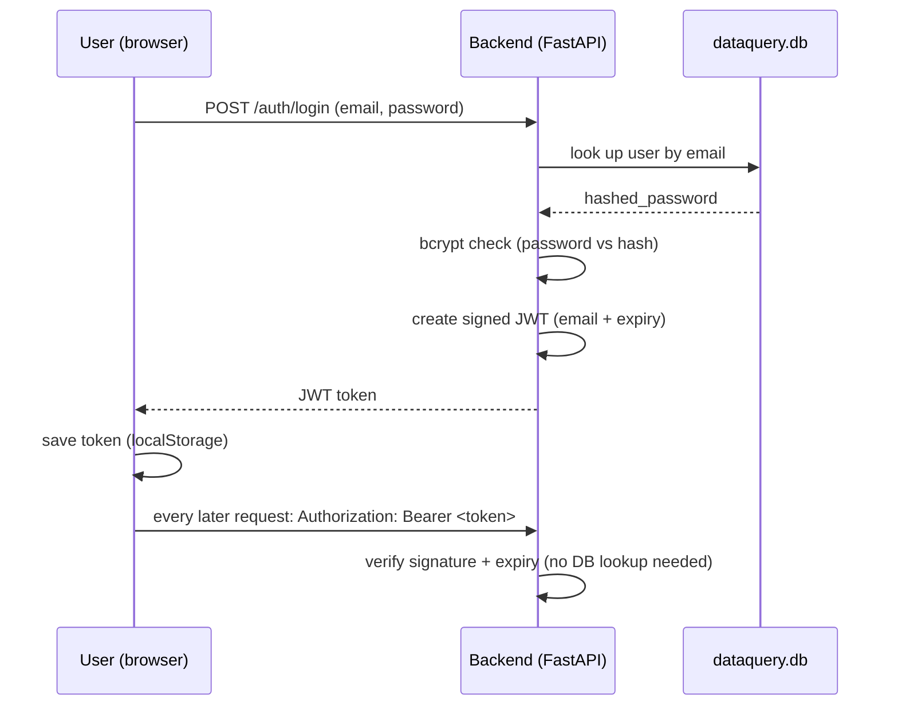
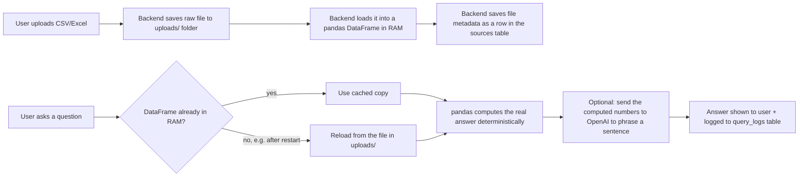
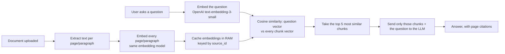
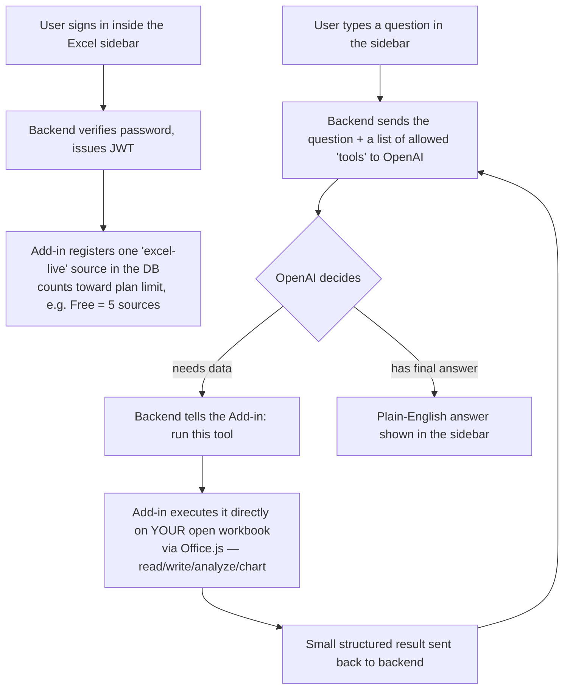

# DataQuery AI

Ask your data anything. Upload Excel/CSV, view it as a spreadsheet, chat with it
in plain English, auto-generate a dashboard, and export the results — built with
**FastAPI + React (Vite)**.

> **Status: Phase 1 (runnable MVP).** Excel/CSV upload, natural-language query,
> auto dashboard, CSV/Excel/PDF export, and JWT auth all work end-to-end. The AI
> query engine runs deterministically with pandas (no API key required) and is
> enhanced with an LLM narrative when `OPENAI_API_KEY` is set. See
> [Roadmap](#roadmap) for what's scaffolded for Phase 2 (SQL agent,
> DB connectors, report generator, subscriptions).

---

## How this app works — architecture & data, explained simply

This section exists so anyone (engineer, PM, exec) can understand **where
data lives, what format it's in, and how a request travels through the
system**, without reading code.

### The three pieces

Think of this as three separate small apps that talk to each other over the
network — none of them can see inside the others' code, they only exchange
messages (HTTP requests):

| Piece | What it is | Where it runs |
|---|---|---|
| **Backend** ("the brain") | Python + FastAPI | A server (your machine in dev; a cloud host like Railway/Render in production) |
| **Frontend** ("the face") | React web app | The user's browser |
| **Excel Add-in** ("the Excel sidebar") | Small React app loaded inside Excel | Inside Microsoft Excel, as a task pane |

The backend is the only piece that talks to the database, the file system,
and OpenAI. The frontend and the Excel add-in never touch data directly —
they only ask the backend for it over the network, and the backend decides
what they're allowed to see.

### Where is data stored, and as what?

| What | Where it lives | Format |
|---|---|---|
| User accounts (email, hashed password, plan) | `backend/dataquery.db` | **SQLite** — a database that is just one file on disk (no separate server process). Swappable to **Postgres** for production by changing one setting (`DATABASE_URL`) — no code changes needed. |
| Metadata about each uploaded file/connection (name, type, row/column counts) | Same `dataquery.db` file, table `sources` | SQLite rows |
| History of questions asked + answers given | Same file, table `query_logs` | SQLite rows |
| Saved dashboards (which charts/filters) | Same file, table `dashboards` | SQLite rows, config stored as a JSON text blob |
| The actual uploaded file (CSV/Excel/PDF/etc.) | `backend/uploads/` folder | The raw file itself, saved under a random generated name |
| The **data inside** an uploaded file, while you're querying it | Server RAM (a Python dict, process memory) | A pandas DataFrame (an in-memory table) — loaded fresh from the file in `uploads/` the first time it's needed, then kept in memory so repeat questions are fast. Cleared when the server restarts; rebuilt from disk on next use. |
| Excel Live chat messages (while chatting with your open workbook) | Server RAM only | **Never written to the database or disk.** Cleared when the backend restarts. This is a deliberate current limitation — no chat history persists across restarts (see "Not production-grade yet" below). |
| Your login token, in the web app | Browser's `localStorage` | A JWT string (see below) |
| Your login token, in the Excel add-in | The add-in's in-memory JS variable only | Same JWT string, but never saved to disk — signing in again is required each time you reopen Excel |

**Nothing about your spreadsheet's actual cell contents is ever stored by
the backend for Excel Live** — the backend only ever sees small snippets
(a range the AI asked to read, or a result the add-in sent back), never the
whole workbook, and none of it is saved after the conversation.

### Login — how it actually works

1. User types email + password in the browser (or the Excel sidebar).
2. Backend looks up the user by email, and checks the password using
   **bcrypt** — a one-way hashing algorithm. The real password is **never**
   stored anywhere, ever; only its hash is. Even someone with full access to
   the database cannot recover the original password from the hash.
3. If it matches, the backend creates a **JWT (JSON Web Token)** — a signed
   piece of text containing just the user's email and an expiry date (7 days
   by default), signed with a secret key (`JWT_SECRET`) only the backend
   knows.
4. The browser (or add-in) stores this token and attaches it to every
   future request (`Authorization: Bearer <token>`).
5. On each request, the backend re-checks the token's signature and expiry —
   there is **no server-side "logged in sessions" table**. The token itself
   *is* the proof of login; if its signature is valid and it hasn't expired,
   the request is trusted.



### "Chat with Data" flow — upload a file and ask it questions



The numbers themselves always come from pandas doing real computation in
Python — the LLM (when a key is configured) only writes the sentence
describing them. It cannot invent a number that pandas didn't compute.

### Do we use RAG (Retrieval-Augmented Generation)?

**Only where it actually helps — Chat with PDF/DOCX/TXT. Not for Chat with
Data or Dashboards**, because that data is structured (rows/columns), and a
real computation (pandas `sum`/`mean`/etc.) is always more accurate than an
LLM reading text chunks and estimating. Here's exactly what each feature
does:

| Feature | Technique | LLM involved? |
|---|---|---|
| Chat with Data (CSV/Excel) — most questions | Rule-based NLU: regex intent detection + a synonym dictionary + fuzzy string matching picks the right columns, then **real pandas operations** (`groupby`, `sum`, `mean`, chi-square test for correlation, etc.) compute the answer | Optional — only to phrase the already-computed numbers as a sentence |
| Chat with Data — complex/open-ended questions ("what if we raised prices 10%", forecasting, segmentation, Pareto analysis) | The LLM **writes actual pandas code** for the specific question, which the backend then runs in a **restricted sandbox** (see below) | Yes — generates code, doesn't just narrate |
| Dashboard auto-generation (KPIs, chart picks, per-chart commentary) | **100% rule-based Python.** No LLM call anywhere in this path. | No |
| Chat with PDF / DOCX / TXT | **Real RAG:** every page/paragraph is turned into a vector embedding (OpenAI `text-embedding-3-small`); the question is embedded too; the chunks whose vectors are most similar (cosine similarity) are retrieved and sent to the LLM — see below | Yes — answers using only the retrieved chunks |
| Excel Live | LLM **tool-calling** (aka "function calling"/agentic loop) — the model picks from a fixed list of tools (read/write/analyze/chart); it never receives the whole workbook | Yes — decides which tool to call each step |

**How Chat with PDF's RAG actually works** (`backend/app/services/embeddings_store.py`):



This means a question like *"what's the termination clause?"* can find a
paragraph that says *"either party may end this agreement…"* — no shared
keywords, but the embeddings recognize they mean the same thing. Plain
keyword search (what this used to do, and what it silently falls back to if
no `OPENAI_API_KEY` is configured or the embedding call fails) would miss
that paragraph entirely.

No separate vector database (e.g. ChromaDB/Pinecone) is used — for the
single-document sizes this app handles, an in-memory numpy array doing
cosine similarity **is** the same math a vector database does internally,
without the extra moving part. Embeddings are cached per document in server
RAM (same pattern as the pandas DataFrame cache) so asking a second question
about the same PDF doesn't re-embed it. If the document is deleted, its
cached embeddings are dropped immediately.

**On the LLM-writes-code path — the safety measures in place:**
- A blocklist rejects any generated code containing `import`, `exec`, `eval`,
  `os.`, `subprocess`, `open(`, `socket`, `requests`, and similar — no file
  system, network, or process access, ever.
- The code runs with a stripped-down set of Python builtins (no `__import__`,
  no `globals()`/`locals()`, no reflection tricks) — only safe things like
  `len`, `sum`, `sorted`, basic types, plus `pandas`/`numpy`/`scipy`. It
  operates on an in-memory *copy* of the DataFrame, never the original.
- If the generated code fails, the backend retries once with the error
  message included, then gives up cleanly rather than looping.

### How Dashboard auto-generation actually works (no LLM)

1. Backend inspects the DataFrame's columns: which are numeric, which are
   categorical, which look like dates.
2. **KPIs** are built by simple heuristics — e.g. a numeric column whose name
   contains "revenue"/"cost"/"amount"/"price" is treated as monetary and
   shown with a `$` and K/M formatting; every dataset gets a "Total Records"
   KPI for free.
3. **Chart type** is picked by rule: a categorical + numeric pair becomes a
   pie chart if there are ≤6 categories, a bar chart otherwise; a date column
   triggers a line chart; two numeric columns trigger a scatter plot.
4. **Per-chart commentary** ("X dominates, contributing 42% of the total…")
   is generated from Python string templates driven by the actual computed
   numbers (concentration %, top-vs-bottom ratio, skew) — not written by an
   LLM.

### "Excel Live" flow — chatting with the workbook you have open



Key point: **the AI never has direct access to the Excel file.** It can only
request one of a fixed set of tools (read a range, write a range, delete a
row, run statistical analysis, create a chart, etc.) — Excel itself, running
on the user's own machine, is what actually executes each one. Anything that
would overwrite existing data or delete something asks for confirmation
first, and the loop is hard-capped at 15 tool calls per question so it can
never run away indefinitely.

### Security measures already in place

- Passwords: bcrypt-hashed, never stored or logged in plain text.
- Login tokens: signed JWTs with an expiry; the signing secret must be a
  real, unique value in production (the app detects and rejects the
  placeholder default).
- CORS: the API only accepts browser requests from an explicit allow-list of
  known frontend/add-in URLs — a random website can't call it from a user's
  browser.
- The OpenAI API key lives only in the backend's environment variables —
  it is never sent to the browser or bundled into the web app or add-in.
- Excel Live has a per-user rate limit and a 15-step iteration cap, so it
  can't be driven into a runaway loop or abused to rack up API costs.
- Workspace plan limits (free/pro/enterprise source counts) are enforced on
  the backend itself — can't be bypassed by calling the API directly.
- Local development runs over HTTPS with a locally-trusted certificate
  (`office-addin-dev-certs`); production would use real TLS certificates
  from the hosting provider.

### Not production-grade yet (worth knowing before a CTO/VP asks)

- **SQLite** is a single file — great for a pilot/demo, but for real
  multi-user production traffic this should move to **Postgres** (the code
  already supports this by just changing `DATABASE_URL`; no code rewrite).
- The in-memory DataFrame cache and the Excel Live conversation store both
  live in one server process's RAM. If the app is ever scaled to run on
  multiple server instances, these need to move to a shared store (e.g.
  Redis) — this is already flagged in code comments where it matters.
- No automated backup of the SQLite file is configured yet.
- Uploaded files sit as plain files on the server's disk. For production at
  scale, this should move to encrypted cloud object storage (e.g. S3) rather
  than local disk.

---

## Quick start (local, no API key needed)

### 1. Backend
```bash
cd backend
python -m venv .venv && source .venv/bin/activate   # Windows: .venv\Scripts\activate
pip install -r requirements.txt
cp .env.example .env                                 # defaults to SQLite, no key
uvicorn app.main:app --reload
```
API runs at http://localhost:8000 — docs at http://localhost:8000/docs

### 2. Frontend
```bash
cd frontend
npm install
cp .env.example .env                                 # VITE_API_URL=http://localhost:8000
npm run dev
```
App runs at http://localhost:5173

### 3. Try it
1. Sign up at `/signup`.
2. Upload `sample_data/sales.csv` (included).
3. Ask: *"top 5 products"*, *"revenue by region"*, *"average price"*.
4. Click **Generate Dashboard**.
5. Export to CSV / Excel / PDF.

## Enable real AI (optional)
Put a key in `backend/.env`:
```
OPENAI_API_KEY=sk-...
```
Most Chat with Data questions still compute results deterministically via
pandas and just get an LLM-written narrative on top. A few complex/open-ended
questions (forecasting, "what if", segmentation) do have the LLM generate
pandas code, which runs in a restricted sandbox — see
["Do we use RAG?"](#do-we-use-rag-retrieval-augmented-generation) below for
exactly what's sandboxed. This same key also turns on real semantic search
(RAG) for Chat with PDF/DOCX/TXT — no separate setup needed. Optionally
override the embedding model with `OPENAI_EMBEDDING_MODEL` (defaults to
`text-embedding-3-small`).

## Excel Live add-in (local dev)

Excel Live lets the AI work on the workbook you already have open in Microsoft
Excel via a chat sidebar (Office Add-in), instead of uploading a file. It's a
sibling project at `./excel-addin` with its own `package.json` — it does not
share a build with `frontend/`.

Requirements: a real `OPENAI_API_KEY` set in `backend/.env` (Excel Live uses
OpenAI tool/function calling — the deterministic pandas engine used by the
other tools doesn't apply here), and Node 18+.

The add-in's task pane sign-in is a plain email/password form built into the
sidebar itself — there is **no separate sign-in popup**. An earlier version
used the Office Dialog API for this (opening a popup that posted a token back
via `messageParent`), but that handshake proved unreliable across Excel
Online sessions, so the task pane now just calls the login API directly, the
same way the web app does.

Office Add-ins are HTTPS-only for the task pane itself, and the task pane
calls the backend directly, so **the backend must run over HTTPS** too
(otherwise the HTTPS task pane calling a plain-HTTP backend gets blocked as
mixed content). The web app itself doesn't need HTTPS — it's not involved in
this flow.

```bash
# 1. Install a trusted local dev certificate (once)
cd excel-addin
npm install
npx office-addin-dev-certs install
```

```bash
# 2. Backend — HTTPS, not the old `uvicorn app.main:app --reload`
cd backend
python run_https.py            # serves https://localhost:8000
```

```bash
# 3. Web app (plain HTTP is fine)
cd frontend
npm run dev                    # serves http://localhost:5173
```

```bash
# 4. Add-in
cd excel-addin
cp .env.example .env           # VITE_API_URL=https://localhost:8000
npm run dev                    # serves https://localhost:3000
```

⚠️ If you already have a backend terminal running the old
`uvicorn app.main:app --reload` command, **stop it (Ctrl+C) and restart with
`python run_https.py`** — the two can silently coexist on port 8000 on
Windows, and requests will land on whichever one wins, producing a confusing
`wrong version number` / SSL error in the add-in.

Sideload the add-in into Excel:
- **Excel on the web or Desktop (Microsoft 365):** Home tab (or Insert tab) →
  Add-ins → **My Add-ins** → **Upload My Add-in** → choose
  `excel-addin/manifest.xml`. (If you only see a **Store** tab with no upload
  option, your account may be an IT-managed work/school account that
  restricts sideloading — use the next option instead.)
- **Excel Desktop, from the terminal:** run `npm run sideload` from
  `excel-addin/` (uses `office-addin-debugging`, requires Excel Desktop
  installed) — this registers the add-in directly via the Windows registry
  and doesn't depend on the upload UI being available.

Once loaded, click the **DataQuery AI** button on the Home ribbon (maximize
the Excel window or check the ribbon's overflow `>>` arrow if you don't see
it), sign in with your DataQuery account directly in the sidebar, and start
chatting — the connection also shows up in the web app at `/tools/excel-live`
and counts as one workspace source, same as an uploaded file.

## Docker
```bash
docker compose up --build
```

## Deploy
- **Frontend → Vercel:** root `frontend/`, build `npm run build`, output `dist`.
  Set `VITE_API_URL` to your backend URL.
- **Backend → Railway/Render:** root `backend/`, start command
  `uvicorn app.main:app --host 0.0.0.0 --port $PORT`. Set `DATABASE_URL`
  (Postgres), `JWT_SECRET`, `CORS_ORIGINS`, and optionally `OPENAI_API_KEY`.

---

## Roadmap

| Feature | Status |
|---|---|
| Auth (JWT signup/login) | ✅ Done |
| Excel / CSV upload + AG Grid | ✅ Done |
| NL query engine (pandas + optional LLM) | ✅ Done |
| Auto dashboard (KPIs, charts, insights) | ✅ Done |
| Export CSV / Excel / PDF | ✅ Done |
| Query history | ✅ Done |
| Excel Live (Office Add-in + tool-calling chat) | ✅ Done — `excel-addin/`, `backend/app/routers/excel_live.py` |
| PDF/DOCX/TXT chat (real RAG — embeddings + cosine similarity) | ✅ Done — `backend/app/services/embeddings_store.py` |
| SQL agent (Postgres/MySQL/Mongo connect) | 🔜 Phase 2 — `api.js` stubbed |
| Report generator (multi-section PDF) | 🔜 Phase 2 |
| Subscriptions (Free/Pro/Enterprise limits) | 🔜 Phase 2 — `plan` field on User |
| LangChain agents, embeddings | 🔜 Phase 2 |

## Structure
```
backend/app/{config,main}.py
backend/app/{database,models,schemas,auth,routers,services,ai}/
frontend/src/{pages,components,charts,contexts,services}/
excel-addin/                      # Office Add-in (task pane) — sibling project, own package.json
```
